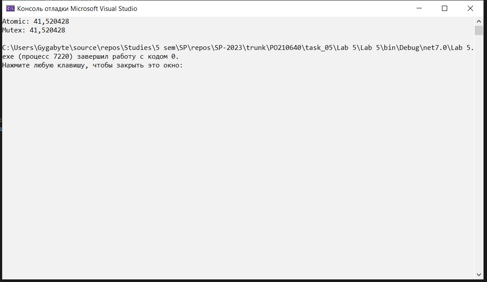

## Цель работы

Научиться работать с многопоточностью в приложениях.
## Задание
Необходимо написать 2 программы, используя в них несколько потоков. Одну из программ реализовать через атомные переменные, вторую – через mutex. Отчёт должен содержать цель работы, код программы, скриншот работы программы и вывод по лабораторной работе.
## Вариант №16 (4)
Создать четыре потока, каждый из которых увеличивает переменную на определённый процент от неё. Потоки должны выполниться последовательно дважды.
## Реализация/ход работы
Изменение значения с помощью атомных операций:
```C#
float valueAtomic = 10.0f;

Action GetIncreaseMethodAtomic(float percent)
{
    return () =>
    {
        var coef = 1.0f + percent / 100.0f;
        var temp = Interlocked.Exchange(ref valueAtomic, 0);
        temp *= coef;
        Interlocked.Exchange(ref valueAtomic, temp);
    };
}
```
Изменение значения с помощью `Mutex`:
```C#
float valueMutex = 10.0f;

Mutex mutex = new();
Action GetIncreaseMethodMutex(float percent)
{
    return () =>
    {
        var coef = 1.0f + percent / 100.0f;
        mutex.WaitOne();
        valueMutex *= coef;
        mutex.ReleaseMutex();
    };
}
```
Код получения необходимой последовательности методов для потоков:
```C#
var lambda = (Func<float, Action> func) =>
{
    float[] percents = { 5.0f, 25.0f, 15.0f, 35.0f, };

    var methodList = new List<Action>();
    foreach (var coef in percents)
    {
        methodList.Add(func(coef));
    }

    IEnumerable<Action> GetActions()
    {
        foreach (var method in methodList)
        {
            yield return method;
        }

        foreach (var method in methodList)
        {
            yield return method;
        }
    }

    return GetActions();
};
```
Рекурсивный метод вызова очередного потока:
```C#
private static void NextThread(IEnumerator<Action> methods)
{
    if (!methods.MoveNext()) return;

    methods.Current.Invoke();

    var thread = new Thread(() => { NextThread(methods); });
    thread.Start();
    thread.Join();
}
```
Вызов 2 цепочек потоков:
```C#
var methodsAtomic = lambda(GetIncreaseMethodAtomic).GetEnumerator();

var threadAtomic = new Thread(() => { NextThread(methodsAtomic); });
threadAtomic.Start();
threadAtomic.Join();

Console.Write("Atomic: ");
Console.WriteLine(valueAtomic);

var methodsMutex = lambda(GetIncreaseMethodMutex).GetEnumerator();

var threadMutex = new Thread(() => { NextThread(methodsMutex); });
threadMutex.Start();
threadMutex.Join();


Console.Write("Mutex: ");
Console.WriteLine(valueMutex);
```

---

## Скрины работы



---

## Вывод
Для данной задачи не требуется использование никаких методов синхронизации потоков, так как все они вызываются последовательно друг из друга.
