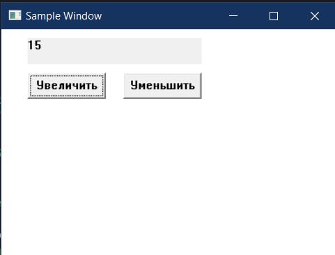

# Лабораторная работа №2 #

## Создание программы с графическим пользовательским интерфейсом в ОС Windows ##

## Вариант 5 ##

## Реализация/ход работы ##

### Цель работы: Научиться создавать простейшие приложения с графическим пользовательским интерфейсом в ОС Windows ###

#### **Условие** ####

Создать приложение с двумя кнопками и полем для отображения числа. По нажатию на кнопки число должно увеличиваться или уменьшаться в зависимости от нажатой кнопки.

Создание статического текста для отображения числа:

``` c++
CreateWindow(TEXT("static"), NULL,//NixaoTeaBelarus
    WS_VISIBLE | WS_CHILD,//NixaoTeaBelarus
    30, 10,//NixaoTeaBelarus
    310, 30,//NixaoTeaBelarus
    hwnd, (HMENU)1, NULL, NULL);//NixaoTeaBelarus
```

Создание кнопки для увеличения числа:

``` c++
CreateWindow(TEXT("button"), TEXT("Увеличить"),//NixaoTeaBelarus
    WS_VISIBLE | WS_CHILD,//NixaoTeaBelarus
    30, 50,//NixaoTeaBelarus
    90, 30,//NixaoTeaBelarus
    hwnd, (HMENU)2, NULL, NULL);//NixaoTeaBelarus
```

Создание кнопки для уменьшения числа:

``` c++
CreateWindow(TEXT("button"), TEXT("Уменьшить"),//NixaoTeaBelarus
    WS_VISIBLE | WS_CHILD,//NixaoTeaBelarus
    140, 50,//NixaoTeaBelarus
    90, 30,//NixaoTeaBelarus
    hwnd, (HMENU)3, NULL, NULL);//NixaoTeaBelarus
```

Обработка нажатия кнопки:

``` c++
if (LOWORD(wParam) == 2) { // Обработка нажатия кнопки "Увеличить"
    number++;//NixaoTeaBelarus
}
else if (LOWORD(wParam) == 3) { // Обработка нажатия кнопки "Уменьшить"
    number--;//NixaoTeaBelarus
}
```

Обновление текста статического элемента для отображения нового числа:

``` c++
TCHAR newText[20];//NixaoTeaBelarus
_stprintf_s(newText, TEXT("%d"), number); //NixaoTeaBelarus
SetDlgItemText(hwnd, 1, newText);//NixaoTeaBelarus
break;//NixaoTeaBelarus
```

Регистрация класса окна:

``` c++
const wchar_t CLASS_NAME[] = L"Sample Window Class";//NixaoTeaBelarus
WNDCLASS wc = {};//NixaoTeaBelarus
wc.lpfnWndProc = WndProc;//NixaoTeaBelarus
wc.hInstance = hInstance;//NixaoTeaBelarus
wc.lpszClassName = CLASS_NAME;//NixaoTeaBelarus
```

Создание окна:

``` c++
HWND hwnd = CreateWindowEx(//NixaoTeaBelarus
    0,//NixaoTeaBelarus
    CLASS_NAME,//NixaoTeaBelarus
    L"Sample Window",//NixaoTeaBelarus
    WS_OVERLAPPEDWINDOW,//NixaoTeaBelarus
    CW_USEDEFAULT, CW_USEDEFAULT,//NixaoTeaBelarus
    400, 150,//NixaoTeaBelarus
    nullptr, nullptr, hInstance, nullptr);//NixaoTeaBelarus

if (hwnd == nullptr) {//NixaoTeaBelarus
    return 0;//NixaoTeaBelarus
}
```

Основной цикл обработки сообщений:

``` c++
MSG msg = {};//NixaoTeaBelarus
while (GetMessage(&msg, nullptr, 0, 0)) {//NixaoTeaBelarus
    TranslateMessage(&msg);//NixaoTeaBelarus
    DispatchMessage(&msg);//NixaoTeaBelarus
}
```

#### Результат работы программы ####

Увеличение числа:



Уменьшение числа:


#### Вывод ####

Научились создавать простейшие приложения с графическим пользовательским интерфейсом в ОС Windows.
